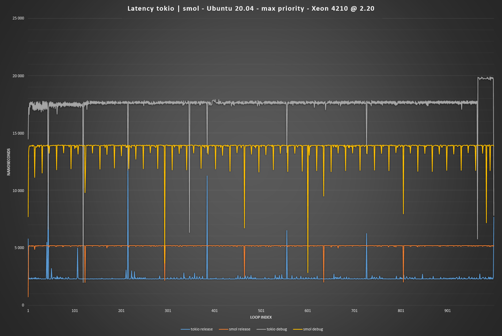

# rust-bench

Just a small multiple crate to test tokio and smoll runtime. Each crate is designed to test one runtime to keep the solution as clean as possible.
Lot of thing can be done to improve this *thing* (as developed inter package common function to format result in a file...)

The small app was developped in order to study and resolve some performance issues on the [Etherage project](https://github.com/jimy-byerley/etherage)

To use it, just run cargo with the name of the package (*runtime-bench*) that you want test.

Exemple:
Data that can be obtains with this solution:


## Optional evolution

[ ] Add more explicit comments
[ ] Add new runtime test
[ ] Add function to draw results in a plot
[ ] Clean the code with the DRY credo in mind
[X] Support a loop limit through argument `-l` or `-limit`
```sh
    $ mybin -l 666
```

# License

Solution relased under the [WTFPL](https://www.wtfpl.net/) version 2.
